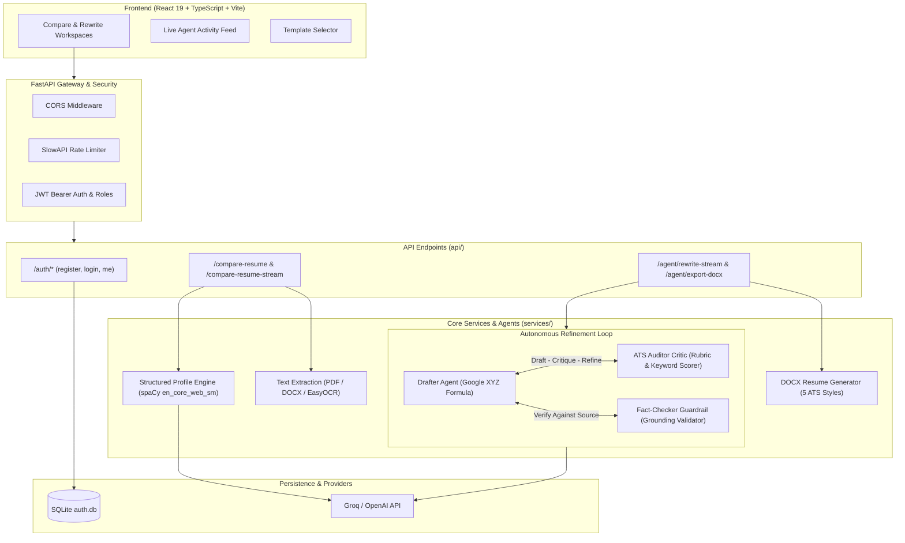

# Agentic AI Resume Analyzer & Career Copilot

An enterprise-grade, agentic AI platform that analyzes resumes against target job descriptions, computes ATS compatibility scores, executes autonomous multi-agent reflection loops to rewrite experience bullets truthfully, and exports ATS-optimized DOCX documents.

Built with a **FastAPI backend** (Python 3.14+ with `uv`) and a **React 19 + TypeScript + Vite frontend**.

---

## Table of Contents

- [Overview](#overview)
- [System Architecture & Request Flow](#system-architecture--request-flow)
  - [High-Level Architecture](#high-level-architecture)
  - [Request Lifecycle & Data Movement](#request-lifecycle--data-movement)
- [Project Structure](#project-structure)
  - [Backend Structure](#backend-structure)
  - [Frontend Structure](#frontend-structure)
- [Key Features & Capabilities](#key-features--capabilities)
  - [1. Multi-Format Text & OCR Extraction](#1-multi-format-text--ocr-extraction)
  - [2. Structured Profiles & ATS Comparison](#2-structured-profiles--ats-comparison)
  - [3. Autonomous Self-Refining Loop](#3-autonomous-self-refining-loop)
  - [4. Fact-Checking & Anti-Hallucination Guardrail](#4-fact-checking--anti-hallucination-guardrail)
  - [5. ATS-Compliant DOCX Template Engine](#5-ats-compliant-docx-template-engine)
  - [6. Real-Time Streaming (NDJSON / SSE)](#6-real-time-streaming-ndjson--sse)
- [API Endpoints Reference](#api-endpoints-reference)
- [Local Environment Setup](#local-environment-setup)
  - [Prerequisites](#prerequisites)
  - [1. Backend Setup](#1-backend-setup)
  - [2. Environment Variables Configuration](#2-environment-variables-configuration)
  - [3. Frontend Setup](#3-frontend-setup)
  - [4. Running the Complete System](#4-running-the-complete-system)
- [Testing & Validation](#testing--validation)
- [Security & Rate Limiting](#security--rate-limiting)

---

## Overview

Traditional resume optimizers rely on single-pass, one-shot LLM prompts that frequently hallucinate skills or output generic keyword stuffing. The **Agentic AI Resume Analyzer** overcomes this through an autonomous multi-agent loop:

1. **Perception Agent**: Ingests resumes (PDF, DOCX, TXT, scanned images via EasyOCR) and constructs structured skill graphs and experience timelines using `spaCy`.
2. **ATS Auditor Critic**: Evaluates keyword density, metric frequency, action verb potency, and Flesch-Kincaid readability against the target job description.
3. **Executive Drafter Agent**: Formulates bullet points adhering strictly to the **Google XYZ Formula** (*"Accomplished [X], measured by [Y], by doing [Z]"*).
4. **Fact-Checker Guardrail**: Validates every skill, tool, and employer against the candidate's original document to guarantee zero hallucinations.
5. **Template Generator**: Transforms markdown drafts into formatted, ATS-compliant `.docx` resumes across 5 tailored aesthetic styles.

---

## System Architecture & Request Flow

### High-Level Architecture



### Request Lifecycle & Data Movement

#### 1. Resume & Job Description Comparison Flow (`/compare-resume-stream`)
```text
User uploads Resume (.pdf/.docx) + Job Description (.txt/.pdf or raw text)
  │
  ▼
[FastAPI Gateway] Validates file extensions, authenticates JWT token, enforces SlowAPI limits
  │
  ▼
[Text Extraction Service] Extracts text via pdfplumber/python-docx; runs EasyOCR for images
  │
  ▼
[Perception & Profile Service] Emits NDJSON progress event -> Frontend displays "Extracting Profile..."
  │  ├─ spaCy tokenizes, identifies named entities, and infers work experience periods
  │  └─ LLM extracts categorized skills with supporting confidence evidence
  │
  ▼
[Structured Comparison] Weighted ATS match calculation:
  │  ├─ Required Skills Coverage
  │  ├─ Preferred Skills Coverage
  │  └─ Experience Duration & Fit
  │
  ▼
[Frontend Response] Emits final JSON payload: ATS score gauge, missing skills chips, recruiter analysis
```

#### 2. Autonomous Resume Rewrite Flow (`/agent/rewrite-stream`)
```text
User initiates Rewrite with Target ATS Score (default 80%) and Max Iterations (default 3)
  │
  ▼
[Iteration 1: Drafter Agent]
  Generates targeted draft using the Google XYZ formula: [Action Verb] + [Context/Metric] + [Method]
  ──> Streams thought to frontend: "Transforming candidate experience..."
  │
  ▼
[Iteration 1: ATS Auditor Critic]
  Audits keyword overlap, metric presence, reading grade level, and action-verb potency
  ──> Computes baseline ATS score (e.g., 68%) and produces structured critique items
  │
  ▼
[Iteration 1: Fact-Checker Guardrail]
  Cross-checks drafted technologies and organizations against original source resume
  ──> Checks grounding: Flags any ungrounded skills or tool hallucinations
  │
  ▼
[Decision Gate: Score >= Target AND Clean Grounding?]
  ├── YES: Halts early and returns optimal draft
  └── NO & Iterations < Max:
        Injects combined ATS + fact-checking critiques back to Drafter Agent
        ──> Repeats refinement loop (Iteration 2, 3...)
  │
  ▼
[DOCX Export: /agent/export-docx]
  User picks a template -> docx_generator_service renders ATS-compliant .docx for download
```

---

## Project Structure

```text
Ai-resume-analyzer/
├── main.py                     # FastAPI application factory, middleware, entrypoint
├── pyproject.toml              # Python dependencies and project metadata (uv managed)
├── uv.lock                     # Locked dependency graph
├── architecture.md             # In-depth architectural design and agent specifications
├── README.md                   # Project documentation and setup instructions
├── AGENTS.md                   # Repository guidelines and module conventions
├── auth.db                     # Local SQLite user & authentication store (git-ignored)
│
├── api/                        # Modular FastAPI route controllers
│   ├── routes.py               # Aggregator router mounting resume and agent endpoints
│   ├── auth_routes.py          # User registration, OAuth2 login, /auth/me
│   ├── resume_routes.py        # /compare-resume, /compare-resume-stream, /health
│   └── agent_routes.py         # /agent/rewrite, /agent/rewrite-stream, /agent/export-docx
│
├── config/                     # Environment configuration & LLM provider setup
│   └── llm_setup.py            # Provider abstraction for Groq and OpenAI clients
│
├── schemas/                    # Pydantic v2 request & response validation models
│   ├── auth.py                 # User credentials, token schemas
│   ├── resume.py               # Profile, comparison, skill matching, recruiter analysis
│   └── agent.py                # ATS audit, critique items, fact check, reflection loop
│
├── services/                   # Business logic and agent implementation
│   ├── text_extraction_service.py      # Multi-format parsers (PDF, DOCX, TXT, EasyOCR)
│   ├── markdown_converter_service.py   # Markdown parsing and structure normalization
│   ├── profile_service.py              # spaCy profile extraction & timeline inference
│   ├── skill_service.py                # Skill extraction and Jaccard similarity
│   ├── analysis_service.py             # Recruiter feedback and gap recommendations
│   ├── structured_comparison_service.py# Weighted ATS scoring algorithm
│   ├── docx_generator_service.py       # 5 ATS-compliant DOCX resume templates
│   ├── auth_service.py                 # SQLite database, PBKDF2 hashing, JWT generation
│   ├── prompts.py                      # System prompts for extraction, auditing, drafting
│   └── agents/                         # Autonomous multi-agent reflection ecosystem
│       ├── drafter_agent.py            # Resume bullet transformation (Google XYZ)
│       ├── auditor_agent.py            # ATS rubric evaluation & critique generation
│       ├── fact_checker_agent.py       # Factual grounding & anti-hallucination check
│       └── refinement_loop.py          # Orchestrator running the Draft-Critique-Refine loop
│
├── utils/                      # Utilities and shared helpers
│   ├── file_utils.py           # Upload extension checks, temp file cleanup, JD resolution
│   ├── limiter.py              # SlowAPI rate limiting configuration
│   └── logger.py               # Centralized pipeline file and console logger
│
├── test/                       # Automated pytest test suite (29 tests)
│   ├── test_text_extraction.py
│   ├── test_structured_comparison.py
│   ├── test_auditor_agent.py
│   ├── test_fact_checker.py
│   ├── test_refinement_loop.py
│   ├── test_docx_templates.py
│   ├── test_markdown_converter.py
│   └── test_streaming_endpoints.py
│
└── frontend/                   # Single Page Application (React 19 + TypeScript + Vite)
    ├── package.json            # Frontend dependencies and build scripts
    ├── vite.config.ts          # Vite build and dev-server configuration
    ├── tsconfig.json           # TypeScript compiler configuration
    └── src/
        ├── main.tsx            # React application root entrypoint
        ├── App.tsx             # Route definitions & protected route wrapping
        ├── index.css           # Design system tokens, utilities, and glassmorphism styling
        ├── api/                # API HTTP client functions
        │   ├── client.ts       # Centralized fetch wrapper with auth header injection
        │   ├── auth.ts         # Login, register, and token management
        │   └── resume.ts       # Compare, rewrite, SSE streaming, DOCX export calls
        ├── context/
        │   └── AuthContext.tsx # React context for authentication state & user session
        ├── types/
        │   └── api.ts          # TypeScript interfaces mirroring Pydantic backend models
        ├── pages/
        │   ├── HomePage.tsx    # Landing page with system overview and features
        │   ├── LoginPage.tsx   # User login interface
        │   ├── RegisterPage.tsx# User registration interface
        │   ├── ComparePage.tsx # Side-by-side ATS comparison with live perception stream
        │   └── RewritePage.tsx # Multi-agent resume refiner workspace with live activity feed
        └── components/
            ├── Layout.tsx              # Top navigation bar and layout wrapper
            ├── ProtectedRoute.tsx      # Route guard for authenticated views
            ├── FileUpload.tsx          # Drag-and-drop file upload component
            ├── AgentActivityFeed.tsx   # Live visual stream of agent thoughts & iterations
            ├── AgentAuditCard.tsx      # Scorecards, keyword gaps, and actionable critiques
            ├── TemplateSelector.tsx    # Visual picker for 5 ATS DOCX resume templates
            ├── MatchScore.tsx          # Circular and progress bar score visualizers
            ├── SkillTags.tsx           # Categorized matched/missing skill badge tags
            └── AnalysisCard.tsx        # Recruiter analysis and recommendations view
```

---

## Key Features & Capabilities

### 1. Multi-Format Text & OCR Extraction
- Extracts textual content from `.pdf`, `.doc`, `.docx`, `.txt`, `.rtf`, `.md`, and `.csv`.
- Built-in **EasyOCR** engine for image resumes (`.png`, `.jpg`, `.jpeg`), enabling parsing of scanned resumes without native C++ compilation issues on Windows.
- Automatic whitespace normalization, bullet cleaning, and temporary file disposal.

### 2. Structured Profiles & ATS Comparison
- Uses `spaCy` (`en_core_web_sm`) tokenization alongside the configured LLM to extract:
  - Technical and soft skills tagged with confidence scores.
  - Employment history, verified organizations, and duration in years.
  - Job description requirements partitioned into *Required* vs. *Preferred* skills.
- Produces a weighted composite ATS score:
  $$\text{Overall Score} = 0.50 \times \text{Required Skills} + 0.20 \times \text{Preferred Skills} + 0.30 \times \text{Experience Fit}$$

### 3. Autonomous Self-Refining Loop
- Rather than static single-pass prompt generation, the Drafter and Auditor engage in a closed-loop review cycle.
- The Auditor scores the draft on:
  - Keyword density & coverage.
  - Quantified impact metrics.
  - Strong action verbs (e.g., *Spearheaded, Architected, Reduced* vs. *Assisted, Handled*).
  - Reading grade level (Flesch-Kincaid index).
- Generates actionable, categorized critiques (`high`, `medium`, `low` severity) that guide the Drafter in subsequent iterations.

### 4. Fact-Checking & Anti-Hallucination Guardrail
- Automated grounding validation compares extracted named entities, technologies, and organizations in the generated draft against the original source resume.
- Prevents LLMs from inventing unearned tools, certifications, or previous employers.
- If hallucinations are detected, the loop triggers corrective refinement before final output.

### 5. ATS-Compliant DOCX Template Engine
Supports 5 distinct professional templates designed to pass ATS parsing filters (single-column, standard semantic headings, clean margin spacing, no unparsable tables):

| Template ID | Name | Target Persona | Accent Palette |
| :--- | :--- | :--- | :--- |
| `modern_teal` | **Modern Minimalist** (Default) | Tech, Product, Startups | Deep Teal (`#0F766E`) |
| `executive_navy` | **Executive Classic** | Leadership, Finance, Consulting | Deep Navy (`#1E3A8A`) |
| `tech_indigo` | **Tech & Developer** | Software Engineers, DevOps | Electric Indigo (`#4338CA`) |
| `elegant_burgundy`| **Elegant Academic** | Research, Academia, Medical | Burgundy (`#881337`) |
| `compact_slate` | **Compact High-Density** | Senior Multi-Page Histories | Slate Graphite (`#1F2937`) |

### 6. Real-Time Streaming (NDJSON / SSE)
- Both `/compare-resume-stream` and `/agent/rewrite-stream` stream server-sent progress events in NDJSON format.
- The React frontend displays the real-time thought process of each agent (*Perception*, *Drafter*, *Auditor*, *Fact-Checker*) in the [AgentActivityFeed](file:///d:/MY_PROJECT/Ai-resume-analyzer/frontend/src/components/AgentActivityFeed.tsx).

---

## API Endpoints Reference

### Authentication
- `POST /auth/register` - Create a new user account (PBKDF2 password hashing).
- `POST /auth/login` - OAuth2 form-data authentication, returns JWT bearer token.
- `GET /auth/me` - Returns the authenticated user's ID, username, and role.

### Resume Analysis & Comparison
- `GET /health` - Service health status.
- `POST /compare-skill-sections` - JSON-based quick comparison of skill arrays.
- `POST /compare-resume` - Multipart upload (`resume` file + `job_description` file or text), returns full comparison schema.
- `POST /compare-resume-stream` - Streaming NDJSON endpoint for real-time perception agent feedback.

### Multi-Agent Rewriting & Export
- `GET /agent/templates` - Returns metadata and style descriptions for the 5 DOCX templates.
- `POST /rewrite-resume` - Direct rewrite returning a downloadable `.docx` file.
- `POST /agent/rewrite` - Synchronous reflection loop returning complete multi-iteration audit history.
- `POST /agent/rewrite-stream` - Streaming NDJSON reflection loop showing thoughts across each iteration.
- `POST /agent/export-docx` - Converts markdown/text resume content into a styled `.docx` file.

*All endpoints except `/health`, `/auth/register`, and `/auth/login` require an `Authorization: Bearer <token>` header.*

---

## Local Environment Setup

### Prerequisites
- **Python 3.14+** (or Python 3.11+)
- **uv** package manager ([Install uv](https://docs.astral.sh/uv/getting-started/installation/))
- **Node.js 18+** & **npm**
- **Git**

---

### 1. Backend Setup

1. **Clone the repository:**
   ```bash
   git clone <repository-url>
   cd Ai-resume-analyzer
   ```

2. **Install Python dependencies using `uv`:**
   ```powershell
   uv sync
   ```

3. **Install the spaCy English language model:**
   ```powershell
   uv run python -m spacy download en_core_web_sm
   ```

---

### 2. Environment Variables Configuration

Copy `.env.example` to create your local `.env` file:

```powershell
Copy-Item .env.example .env
```

Edit `.env` and set your credentials:

```dotenv
# --- LLM Provider Settings ---
# Options: 'groq' or 'openai'
LLM_PROVIDER=groq
GROQ_API_KEY=gsk_your_groq_api_key_here
LLM_MODEL=groq/compound-mini

# To use OpenAI instead:
# LLM_PROVIDER=openai
# OPENAI_API_KEY=sk-your_openai_api_key_here
# LLM_MODEL=gpt-4o-mini

# --- NLP & Parsing Settings ---
SPACY_MODEL=en_core_web_sm

# --- Security & JWT Settings ---
# Must be at least 32 characters long
JWT_SECRET_KEY=replace_this_with_a_random_secret_string_minimum_32_chars
ACCESS_TOKEN_EXPIRE_MINUTES=60

# --- CORS Settings ---
CORS_ORIGINS=http://127.0.0.1:5173,http://localhost:5173
```

---

### 3. Frontend Setup

1. **Navigate to the frontend directory:**
   ```powershell
   cd frontend
   ```

2. **Install Node dependencies:**
   ```powershell
   npm install
   ```

3. **(Optional) Configure frontend environment:**
   By default, Vite proxies requests to `http://127.0.0.1:8000`. You can create `frontend/.env`:
   ```dotenv
   VITE_API_BASE_URL=http://127.0.0.1:8000
   ```

---

### 4. Running the Complete System

Open two terminal windows:

#### Terminal 1: Backend Server (FastAPI)
From the project root:
```powershell
uv run python -m uvicorn main:app --reload --host 127.0.0.1 --port 8000
```
- **API URL**: `http://127.0.0.1:8000`
- **Interactive Swagger Docs**: `http://127.0.0.1:8000/docs`
- **Alternative Redoc**: `http://127.0.0.1:8000/redoc`

#### Terminal 2: Frontend Dev Server (Vite)
From the `frontend/` directory:
```powershell
npm run dev
```
- **Web App**: `http://localhost:5173`

---

## Testing & Validation

### Automated Backend Tests
Run the 29-test automated pytest suite:
```powershell
uv run pytest
```

### Module Syntax & Compilation Verification
Verify that all Python modules compile cleanly without syntax errors:
```powershell
uv run python -m py_compile main.py api\*.py services\*.py services\agents\*.py schemas\*.py utils\*.py config\*.py
```

### Frontend Code Quality
Check TypeScript types and linting:
```powershell
cd frontend
npm run lint
npm run build
```

---

## Security & Rate Limiting

- **Password Security**: Passwords hashed with standard PBKDF2 using secure salts before storage in `auth.db`.
- **JWT Authorization**: Authenticated endpoints enforce role and expiration validations.
- **SlowAPI Rate Limiting**: Protects high-cost LLM endpoints (`/compare-resume`, `/agent/rewrite`) against denial-of-service or quota exhaustion.
- **Input Sanitization**: File uploads are verified against strict extension whitelists (`.pdf`, `.doc`, `.docx`, `.txt`, `.png`, `.jpg`, `.jpeg`). All temporary files are automatically unlinked upon request completion.
