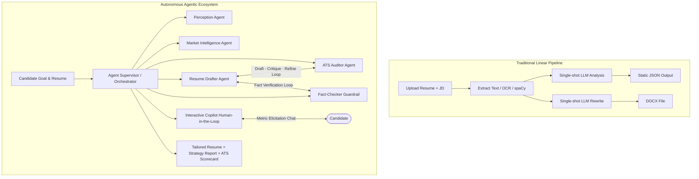
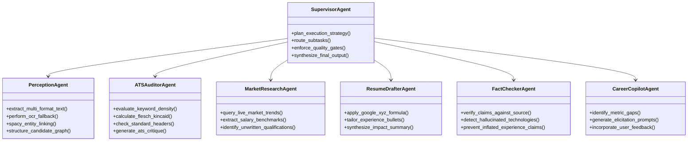
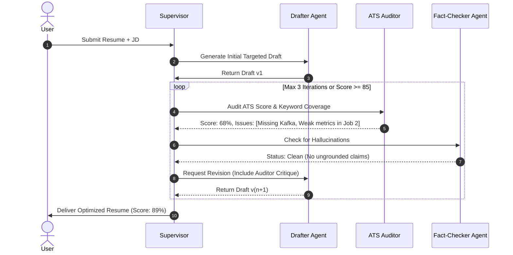
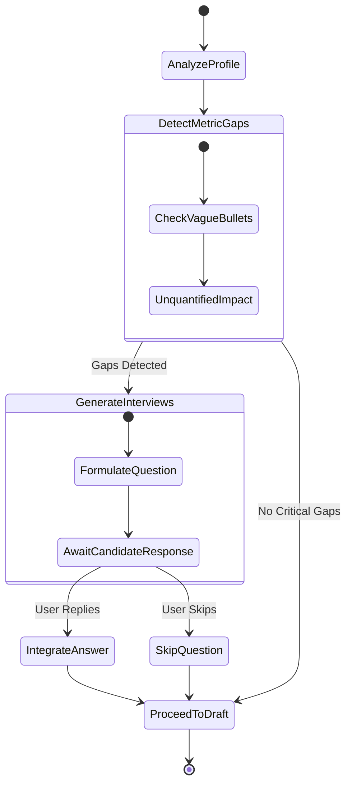
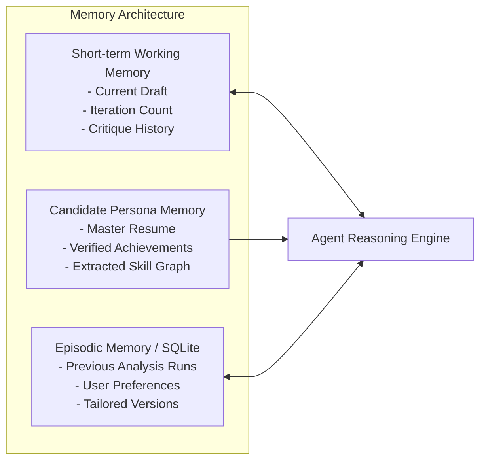

# Agentic AI Resume Analyzer & Career Copilot Architecture

## 1. Executive Summary & Vision

The **AI Resume Analyzer** evolves from a traditional single-pass LLM pipeline into an **Autonomous Multi-Agent Career Copilot**. 

Unlike standard linear pipelines that execute fixed prompts and produce one-shot outputs, this agentic architecture introduces:
- **Autonomous Multi-Agent Collaboration**: Specialized agents with distinct personas, objectives, and domain boundaries.
- **Reflection & Self-Correction Loops**: An evaluator-critic mechanism ensuring resumes meet ATS and truthfulness thresholds before delivery.
- **Tool-Equipped Agents (ReAct)**: Dynamic function calling for live job-market research, similarity scoring, and document formatting.
- **Human-in-the-Loop Interactive Interviewing**: Proactively interviewing candidates to elicit missing quantified metrics rather than hallucinating achievements.

---

## 2. System Paradigm Comparison



---

## 3. Specialized Agent Roles & Responsibilities



### 3.1. Supervisor / Orchestrator Agent
- **Responsibility**: Maintains system state, schedules agent executions, and verifies criteria before transitioning stages.
- **Decision Engine**: Decides whether a drafted section is production-ready or requires another iteration based on quality gates.

### 3.2. Perception & Ingestion Agent
- **Responsibility**: Multi-modal ingestion (PDF, DOCX, TXT, Images).
- **Core Capabilities**:
  - `pdfplumber` for text extraction.
  - `easyocr` for scanned resume images.
  - `spaCy` (`en_core_web_sm`) tokenization, entity recognition, and timeline inference.

### 3.3. ATS Auditor Agent (The Critic)
- **Responsibility**: Scans drafts through the lens of enterprise Applicant Tracking Systems (Workday, Greenhouse, Taleo).
- **Audit Metrics**:
  - Exact & semantic keyword overlap with target JD.
  - Bullet-point readability (Flesch-Kincaid grade level 8–11).
  - Action-verb potency index.
  - Elimination of tables, multi-column layouts, and unparsable glyphs.

### 3.4. Industry & Market Research Agent
- **Responsibility**: Contextualizes the target job description against broader industry realities.
- **Capabilities**:
  - Identifies adjacent and implicit technologies (e.g., if target is Kubernetes, infer Helm, Docker, and ArgoCD relevance).
  - Supplies the Drafter with high-impact industry terminology.

### 3.5. Executive Resume Drafter Agent
- **Responsibility**: Creates high-impact professional bullets.
- **Formulation Rules**:
  - **Google XYZ Formula**: *"Accomplished [X] as measured by [Y], by doing [Z]"*.
  - Strict formatting compliance for DOCX generation.

### 3.6. Fact-Checker & Anti-Hallucination Guardrail Agent
- **Responsibility**: Quality control and honesty enforcement.
- **Safety Policy**:
  - Compares every technical skill, company name, degree, and timeline in the generated draft against the original resume.
  - Automatically flags or rejects bullets claiming tools the candidate has never worked with.

### 3.7. Career Copilot (Human-in-the-Loop Interviewer)
- **Responsibility**: Converts knowledge gaps into conversational questions.
- **Example Flow**:
  - Detects: *"Candidate used PostgreSQL, but provided no performance or scale metrics."*
  - Prompts User: *"Did you optimize queries, implement indexing, or manage database size for PostgreSQL? If so, what was the scale or latency improvement?"*
  - Candidate Answer: *"Reduced query latency by 40% on a 500GB database."*
  - Action: Drafter upgrades bullet with real candidate numbers.

---

## 4. Key Agentic Workflows

### 4.1. The Autonomous Draft-Critique-Refine Loop



---

### 4.2. Human-in-the-Loop Gap-Filling Flow



---

## 5. Tool Registry & ReAct Function Interface

Agents interact with system capabilities via structured JSON schemas:

```python
# Tool Definitions for Agent Execution
TOOLS = [
    {
        "name": "calculate_ats_compatibility",
        "description": "Calculates semantic and exact keyword match scores between resume text and job description.",
        "parameters": {
            "resume_text": {"type": "string", "description": "Candidate resume content"},
            "job_description_text": {"type": "string", "description": "Target job description"},
        },
    },
    {
        "name": "validate_factual_consistency",
        "description": "Cross-verifies rewritten bullets against source resume to eliminate hallucinations.",
        "parameters": {
            "original_resume": {"type": "string"},
            "draft_bullet": {"type": "string"},
        },
    },
    {
        "name": "search_market_competencies",
        "description": "Discovers current industry-standard skills for a specific job title.",
        "parameters": {
            "job_title": {"type": "string"},
            "industry": {"type": "string"},
        },
    },
    {
        "name": "generate_tailored_docx",
        "description": "Formats approved resume draft into an ATS-friendly, clean DOCX file.",
        "parameters": {
            "profile_data": {"type": "object"},
            "target_filename": {"type": "string"},
        },
    },
]
```

---

## 6. Agent Memory & State Management



1. **Short-term Working Memory**: Carries state across the multi-step `Draft -> Critique -> Refine` execution graph.
2. **Candidate Persona Memory**: Stores verified personal facts and past responses so the agent never asks the same question twice.
3. **Episodic Memory (SQLite `auth.db` / `resumes.db`)**: Stores previous versions, scores, and job descriptions per user account.

---

## 7. Integration with Current FastAPI & React Stack

### 7.1. Backend Module Evolution (`api/` & `services/`)
- `services/agents/`:
  - `supervisor.py`: State graph and orchestration controller.
  - `auditor_agent.py`: ATS evaluation logic and rubric scoring.
  - `drafter_agent.py`: Resume rewriting and bullet-point crafting.
  - `fact_checker_agent.py`: Grounding validator.
  - `copilot_agent.py`: Question generation for missing metrics.
- `services/tools/`:
  - Exposes `profile_service`, `text_extraction_service`, and `similarity_service` as callable agent tools.
- `api/agent_routes.py`:
  - `POST /agent/analyze-and-refine`: Trigger autonomous refinement loop with SSE (Server-Sent Events) streaming step progress.
  - `POST /agent/interview-session`: Interactive question-and-answer endpoint for gap filling.

### 7.2. Frontend Interactive UI (`frontend/src/`)
- **Live Agent Activity Feed**: Displays reasoning steps (e.g., *"Auditing ATS keywords..."*, *"Refining bullet 3..."*, *"Verified 0 hallucinations"*).
- **Interactive Metric Interview Modal**: Simple conversational prompt cards for candidate to supply numbers.
- **Before vs After Diff Viewer**: Real-time side-by-side comparison of original vs agent-refined resume.

---

## 8. Implementation Roadmap

| Phase | Milestone | Deliverables |
| :--- | :--- | :--- |
| **Phase 1** | **Self-Refining Loop** | Drafter + ATS Auditor feedback loop in `services/resume_rewrite_service.py` with score thresholding. |
| **Phase 2** | **Fact-Checking Guardrail** | Automated entity-grounding validator to eliminate LLM hallucinations before DOCX output. |
| **Phase 3** | **Interactive Copilot** | SSE streaming in FastAPI + React chat modal for metric elicitation. |
| **Phase 4** | **Multi-Role Tailoring** | Batch multi-JD optimization and automated gap-closure roadmaps. |
